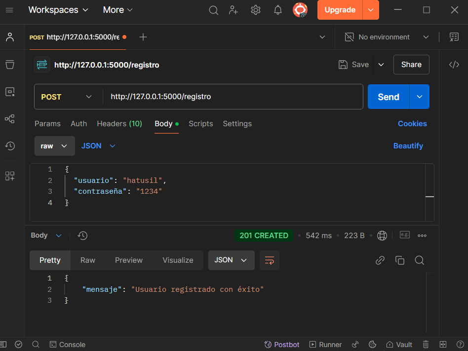
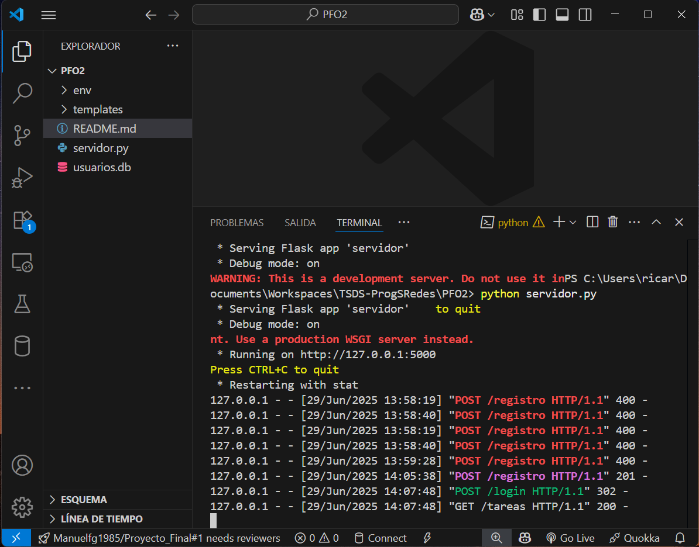
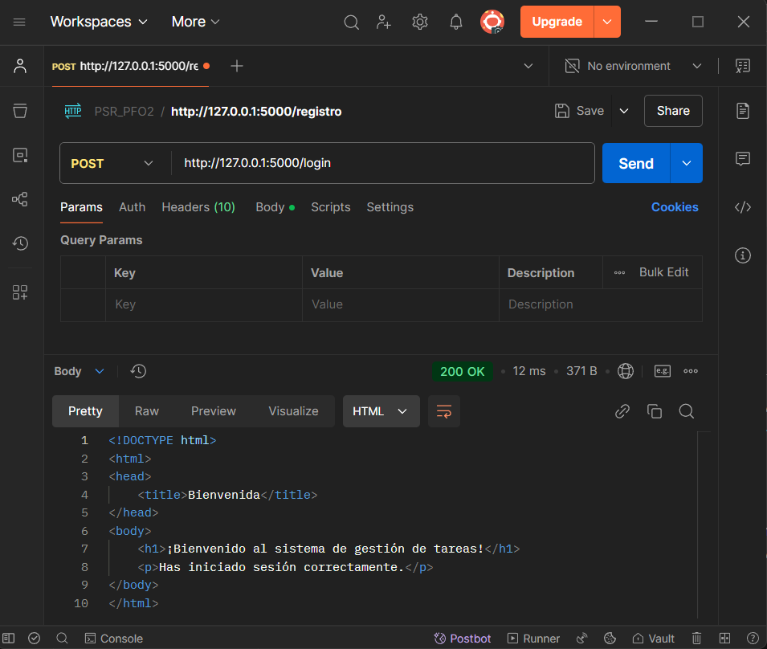

# PFO 2 - Sistema de Gestión de Tareas (Flask + SQLite)

Este proyecto es una API simple para registrar usuarios, iniciar sesión y acceder a una página de bienvenida, usando Flask, SQLite y autenticación básica con contraseñas hasheadas.

---

## 🚀 Requisitos

- Python 3.x
- Flask
- Flask SQLAlchemy
- Flask Bcrypt

---

## ⚙️ Instalación y ejecución

1. Clonar el repositorio:

```bash
git clone https://github.com/hatusil/pfo2-tareas.git
cd pfo2-tareas
```

2. Crear y activar el entorno virtual:

```bash
python -m venv env
.\env\Scriptsctivate
```

3. Instalar dependencias:

```bash
pip install flask flask_sqlalchemy flask_bcrypt
```

4. Ejecutar el servidor:

```bash
python servidor.py
```

---

## 📬 Endpoints

### ✅ Registro de Usuario

**POST** `/registro`

```json
{
  "usuario": "hatusil",
  "contraseña": "1234"
}
```

### ✅ Inicio de Sesión

**POST** `/login`

```json
{
  "usuario": "hatusil",
  "contraseña": "1234"
}
```

✅ Si las credenciales son correctas, redirige a `/tareas`.

---

### ✅ Página de bienvenida

**GET** `/tareas`

Muestra un HTML básico con un mensaje de bienvenida.

---

## 🧠 Respuestas conceptuales

### ¿Por qué hashear contraseñas?

Porque guardar contraseñas en texto plano es inseguro. Si la base de datos es comprometida, los atacantes podrían ver todas las contraseñas. Hashearlas las transforma en un formato irreversible y seguro.

### Ventajas de usar SQLite

- No requiere instalación de servidor.
- Ideal para aplicaciones pequeñas.
- Archivo único y portable (`usuarios.db`).
- Muy liviano y fácil de usar con SQLAlchemy.

---

## 📸 Capturas de pantalla

- Registro exitoso ✅
  
- Login exitoso ✅
  
- Página de bienvenida ✅
  
---

## 📦 Hosting en GitHub

Este repositorio se encuentra alojado en GitHub y documentado con GitHub Pages (aunque la API no se puede correr directamente desde Pages, el README queda accesible públicamente).